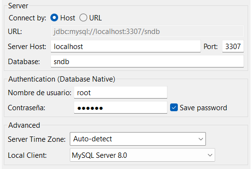

# desafio-sn

Para levantar el servidor sera necesario administrar algunas credenciales, para ello se debera crear un archivo `.env` con las credenciales detalladas en el archivo `env.example`. Una vez asignadas, puede ejecutar el comando `npm install` para instalar las dependencias del servidor.

Una vez instaladas las dependencias puede correr el comando:
`docker-compose build`

Este creara las imágenes de los servicios definidos en el archivo docker-compose.yml, buscando en cada directorio asociado a un servicio y utiliza esas instrucciones para construir la imagen de Docker correspondiente.

En el archivo `docker-compose.yml `tenemos un servicio para la base de datos, y otro para el servidor. De esta manera evitamos la necesitad de tener que instalar el motor de base de datos y de crear un usuario en la misma.

Luego corremos el comando
`docker-compose up.`
Este se utiliza para levantar y ejecutar los contenedores de los servicios definidos en el archivo docker-compose.yml. Este comando también puede construir las imágenes si no se han construido previamente o si hay cambios en los archivos desde la última construcción (si se agruega la opción --build).

#### Puerto de base de datos: 3307

#### Puerto del servidor: 3000

Ejemplo de configuracion de conexion mediante DBeaver

